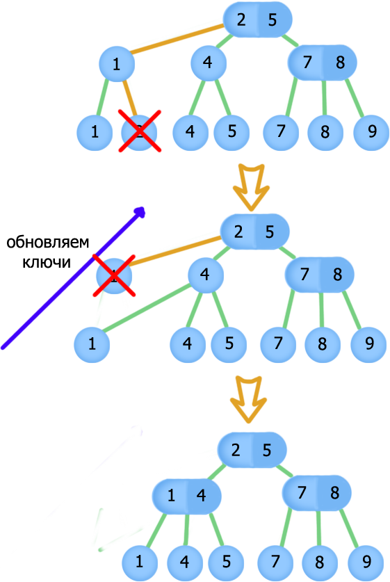

# Вопрос 13: 2-3 ­дерево. Алгоритмы вставки и удаления. Рекомендация по кодированию в виде варианта ДДП.


 **2-3 дерево** - вид дерева, где данные хранятся в листьях, остальные узлы ­ управляющие.
Каждый узел может иметь 2 или 3 потомка и содержит наибольшие значения ключей в левом и среднем
поддеревьях. Если после вставки или удаления у управляющего узла оказывается 1 или 4 потомка­ дерево
перестраивается.

**Правила управляющих узлов:**

1. первое поле строго больше левого поддерева (всех его значений) и меньше или равно правому
(или среднему, если полей 2) поддереву (всех его значений)

2. второе поле строго больше среднего поддерева, и меньше или равно правому поддереву (по
значениям узлов)

(Для справки: имеется разновидность 2-­3-­4 дерева, где идёт построение по схожему принципу, но в
управляющем узле может быть 4 поля)

(Примечание, в ряде литературы, показываются примеры, когда управляющие узлы 2-­3 дерева также
хранят информацию об узлах, а не только листья, но в методе только листья)

**Алгоритм вставки:**


При вставке мы ищем этот элемент в дереве. Если элемента нет или дерево пустое ­ добавляем узел

При пустом дереве ­ вставляем в качестве корня одну единственную вершину ­ это значение, оно
и будет корнем дерева)
При заполненном дереве ­ мы ищем место, куда вставить узел. Тут имеется несколько случаев :

1. На найденном месте у родителя имеется 2 потомка, тогда мы делаем третий (в управляющем узле
появляется поле и новый лист, отсортированные по возрастанию слева направо)

2. У родителя имеется 3 потомка, в этом случае нужно сбалансировать дерево, так как при вставке мы
получаем 4 потомка, что рушит концепцию. Значение попадет в один из листов. Простой вариант ­
превратить лист в управляющий узел, и создать двух потомков. Более сложный ­ сделать
сбалансированное дерево. В этом случае действует следующий принцип. Если у узла 4 потомка
(листья или управляющие узлы ­ не имеет значение) ­ мы делим узел на два новых. Повторяем
проверку на 4 потомка у родительского узла.

```cpp
splitParent(Node t){
    if (t.length > 3){
      Node a = Node(sons = {t.sons[2], t.sons[3]}, keys = {t.keys[2]}, parent = t.parent, length = 2)
      t.sons[2].parent = a
      t.sons[3].parent = a
      t.length = 2
      t.sons[2] = null
      t.sons[3] = null
      if (t.parent != null){
        t.parent[t.length] = a
        t.length++
        // сортируем сыновей у t.parent
        splitParent(t.parent)
      }
      else{                   // мы расщепили корень, надо подвесить его к общему родителю, который будет новым корнем
        Node t = root
        root.sons[0] = t
        root.sons[1] = a
        t.parent = root
        a.parent = root
        root.length = 2
        //сортируем сыновей у root
      }
    }
}
```

```cpp
updateKeys(Node t){
  Node a = t.parent
  while (a != null)
   for(i=0;i<a.length-1;i++)
     a.keys[i] = max(a.sons[i]) // max — возвращает максимальное значение в поддереве.
   a = a.parent                 // Примечание: max легко находить, если хранить максимум
                                // правого поддерева в каждом узле — это значение и будет max(a.sons[i])
}
```

```cpp
insert(T x){
  Node n = Node(x)
  if (root == null){
   root = n
   return
 }
  Node a = searchNode(x)    //поиск 
  if (a.parent == null){
    Node t = root
    root.sons[0] = t
    root.sons[1] = n
    t.parent = root
    n.parent = root
    root.length = 2
    //сортируем сыновей у root
  }
  else{
    Node p = a.parent
    p.sons[p.length] = n
    p.length++
    n.parent = p
    //сортируем сыновей у p
    updateKeys(n)
    split(n);
  }
  updateKeys(n);
}
```

**Алгоритм удаления:**



* Если искомый узел (лист) найден ­ смотрим на родителя, сколько у него потомков.

* Если потомков 3 ­ удаляем узел, изменяя информацию о полях

* Если потомков 2 ­ удаляем узел, перестраивая дерево. Для этого совершаем слияние соседних управляющих узлов. Возможны следующие случаи :

  1. У нового узла после слияния 3 потомка и у родителя этого узла было 3­е потомков, а стало 2. Тогда всё хорошо

  2. У нового узла после слияния 3 потомка, но у родителя стал 1 потомок. В этом случае делим образовавшийся узел.

  3. У нового узла после слияния 4 потомка, и в этом случае мы делим узел Так как после слияния у родительского узла может быть 1 или 2 потомка, при разделении не может быть больше 3 потомков и родительский узел  проверять не надо

**Рекомендации по кодированию:**

1. Хранить 4 указателя у структуры (класса) “Узел”. В этом случае при добавлении мы сможем добавить лист, а потом задействовать алгоритм разделения этого узла, оставив нужную информацию (не обязательно придерживаться этой концепции, можно сначала анализировать разделение узла, но так кажется работать проще)

2. Можно хранить 3 указателя у структуры, но добавлять новое число как второе поле листа или запоминать его, и разделить, проанализировав новые поддеревья

3. Реализовать функции разбиения можно рекурсивно, по отношению к родителям (с внутренней проверкой, нужно разбивать узел или нет)
