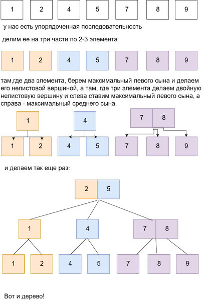

# Вопрос 15: Получение 2-3-дерева из упорядоченной последовательности 

**Получение 2-3 дерева:**

**Некоторые свойства 2-3 дерева:**

* Нелистовые вершины имеют либо 2, либо 3 сына

* Нелистовая вершина, имеющая двух сыновей, хранит максимум левого поддерева. Нелистовая вершина, имеющая трех сыновей, хранит два значения. Первое значение хранит максимум левого поддерева, второе максимум центрального поддерева,

* Сыновья упорядочены по значению максимума поддерева сына

* Все листья лежат на одной глубине 