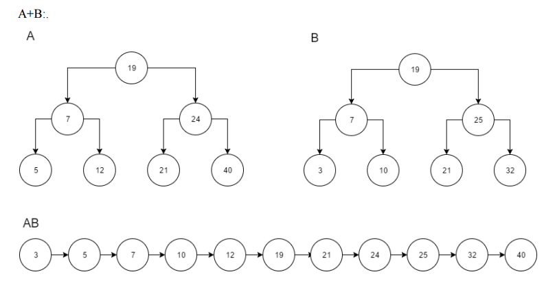

# Вопрос 21: Алгоритм слияния для двуместной операции: чистка хвостов и восстановление дерева-результата

Двуместные операции над множествами в ДДП можно выполнять, используя примитивы проверка–вставка–удаление. Очевидно, что временная сложность двуместной операции при этом будет в среднем $$ O(n \log n) $$. В худшем случае, при  вырожденных деревьях, двуместная операция потребует $$ O(n^2) $$ времени. Более того, если алгоритм порождает упорядоченную последовательность ключей, полученное ДДП всегда будет вырожденным.
Однако можно использовать тот факт, что из ДДП легко получить упорядоченную последовательность ключей внутренним обходом. Применив такой обход к двум ДДП одновременно, можно обработать последовательности алгоритмом слияния, модифицировав его для нужной операции над множествами. Результат в виде упорядоченной последовательности записывается в массив, из которого затем описанным ранее методом деления пополам строится новое ДДП. Этот способ обеспечивает получение результата за время $$ O(n) $$ независимо от формы исходных ДДП, а результат всегда получается сбалансированным.

